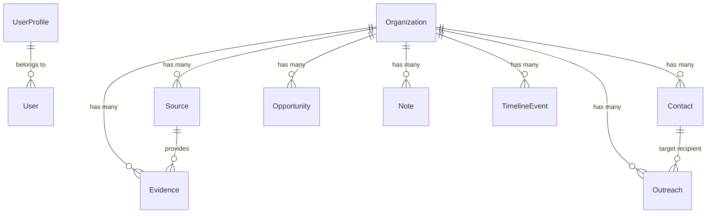

# Project Overview — Personal AI-Powered NYSC PPA Hunting Workspace

---

## 🎯 Executive Summary & Core Problem

Searching for a National Youth Service Corps (NYSC) Place of Primary Assignment (PPA) in Nigeria is currently a messy, high-friction, browser-tab-chaotic process. Corps members routinely spend hours:

- Performing Google searches across dozens of Nigerian corporate websites
- Opening company careers pages and LinkedIn profiles
- Searching for HR/talent acquisition contacts and emails
- Trying to confirm whether an organization accepts NYSC Corps Members
- Losing useful notes across random text files, WhatsApp chats, or mental notes
- Repeating research on the same company and forgetting when follow-ups are due

**Tai's PPA Workspace** turns this chaos into a **single personal research workspace**.

> **"I browse the internet looking for PPA opportunities. The application captures, researches, understands, organizes, and tracks what I find. AI performs repetitive research work, while I remain in control of decisions and outreach."**

---

## 🏛 Architecture & Component Breakdown

The application is structured into 7 modular Django apps following clean service domain isolation:

```text
nysc_workspace/
├── core/                # Today Dashboard, Search, Browser Capture API, Command Palette
├── accounts/            # Single user auth & UserProfile (Skills, Education, Target Locations)
├── organizations/       # Organization records, Opportunities, TimelineEvents, Notes, Tags
├── research/            # Web Fetcher, Search Provider abstraction, Source & Evidence tracking
├── contacts/            # HR Contacts, Provenance tracking, Contact Normalization & Deduplication
├── outreach/            # Outreach history, 5-Day Follow-Up Calculator, Mailto builder
└── ai/                  # Gemini AI Provider, Brief Generator, Next Action Engine, Outreach Drafter
```

---

## 🔑 Key Architectural Highlights

### 1. Evidence-Based Research (Zero AI Hallucination)
- External webpages are treated strictly as **DATA**, never as instructions (preventing prompt injection).
- Every finding is stored with explicit provenance (`Source` URL, `SourceType`, `discovered_at`).
- Evidence claims carry confidence levels (`High`, `Medium`, `Low`, `Unknown`).
- If no evidence of NYSC acceptance is found, the system explicitly labels it **Unknown** rather than assuming refusal.

### 2. Next Action Engine
- Every organization displays 1 obvious recommended next action on the dashboard and detail view.
- Actions are fully explainable (e.g. *"Find recruitment contact because official website exists but no HR email was found"*).

### 3. Nigerian Professional English AI Drafter
- Generates concise, direct Nigerian business tone emails.
- Avoids generic AI fluff ("esteemed organization", "keen interest", "hope this email finds you well").
- Tailors outreach to Tai's Computer Engineering background (Python, Django, Linux) and company evidence.

### 4. Genuinely Mobile-First (NYSC Camp Ready)
- Designed for mobile phones (320px–412px) with thumb-reachable bottom navigation, touch action drawers, and quick capture modals.
- Includes PWA support and local note draft preservation for low connectivity environments.

---

## 📊 Core Data Models Diagram



---

## 🚀 Success Metric

The success metric for this workspace is **not** the number of AI features; it is:

> **"How much less browser/tab management and mental overhead is required while hunting for a PPA."**
